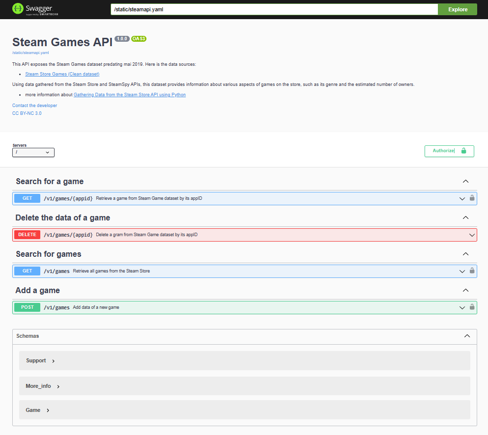

# 🎮 Steam Games API

## 🌐 Overview

The Steam Games API provides access to a dataset of Steam games predating 2019. It allows users to search, retrieve, delete, and add game information from the Steam Game database. This API is documented using Swagger UI for easy interaction and testing.

## 📌 API Version

1.0.0

## 📊 Data Sources

This API uses data collected from:
- [Steam Store Games (Clean Dataset)](https://www.kaggle.com/datasets/nikdavis/steam-store-games)
- Steam APIs

The data provides insights into various aspects of games on the store, such as game genre and the estimated number of owners. More details can be found in the API under the "Support" and "More_info" schemas.

## 🔗 API Base URL

`http://localhost:5000/v1`

## 📡 Endpoints

### 🔍 Search for a Game

- **GET** `/games/{appid}`: Retrieve a game from the Steam Game database by its appID.

### ❌ Delete Game Data

- **DELETE** `/games/{appid}`: Delete a game from the Steam Game database by its appID.

### 📋 Search for Games

- **GET** `/games`: Retrieve all games from the Steam Store.

### ➕ Add a Game

- **POST** `/games`: Add data of a new game.

## 📝 Examples

Here is screenshot of our API

## ©️ License

This API is available under the CC BY-NC 3.0 license. More details can be found at [Creative Commons](https://creativecommons.org/licenses/by-nc/3.0/).
